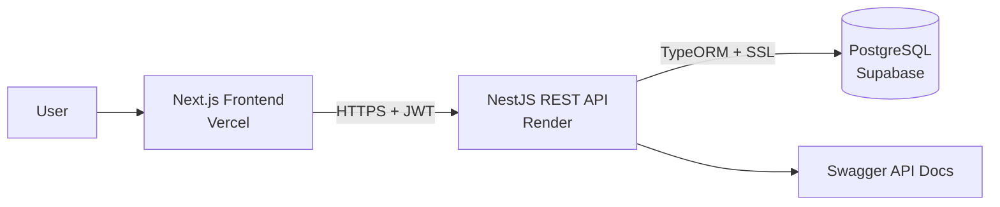

<div align="center">
  

  # Tech Trolley

  ### Mobile Shop Inventory and Internal Sales Management System

  A full-stack, role-based platform for managing mobile-shop inventory, purchases, sales, payments, customers, suppliers, accounts, expenses, and business reports.

  [Live Application](https://tech-trolley.vercel.app) · [API Documentation](https://tech-trolley-api.onrender.com/api) · [Report an Issue](https://github.com/asadbinjafor/Tech-Trolley-Mobile-Shop-Inventory-and-Internal-Sales-Management-System/issues)
</div>

---

## Overview

Tech Trolley centralizes the daily operational workflows of a mobile-device retail business. It provides separate permissions for owners, managers, and salespersons while keeping product, IMEI, purchase, sale, payment, due, and expense records connected through a PostgreSQL database.

The application is being developed as an academic full-stack project at American International University-Bangladesh. Development started in August 2026 and is ongoing.

## Key Features

- Secure registration and JWT-based authentication
- Role-based authorization for Owner, Manager, and Salesperson
- Shop profile and team-member management
- Brand, category, product, and product-status management
- IMEI-based serialized mobile-device inventory tracking
- Stock summaries and individual IMEI lookup
- Purchase creation, supplier payments, and outstanding dues
- Sales creation, customer payments, and outstanding dues
- Customer and supplier management
- Business accounts and expense tracking
- Role-aware dashboard totals and recent activity
- Sales charts and operational reports
- Responsive interface for desktop and mobile devices
- DTO and form validation across the frontend and backend
- Interactive OpenAPI documentation with Swagger UI

## User Roles

| Role | Typical access |
| --- | --- |
| `OWNER` | Full system access, shop settings, team administration, accounts, reports, and all business operations |
| `MANAGER` | Catalog, inventory, purchases, sales, customers, suppliers, expenses, and operational reports |
| `SALESPERSON` | Authorized sales, payment, inventory, and customer-facing workflows |

Backend guards remain the source of truth for authorization. The frontend also hides navigation and actions that are not available to the signed-in role.

## Technology Stack

| Area | Technologies |
| --- | --- |
| Frontend | Next.js 16, React 19, TypeScript, Tailwind CSS 4 |
| Forms and validation | React Hook Form, Zod |
| API client and UI | Axios, Recharts, Lucide, Sonner |
| Backend | NestJS 11, TypeScript, REST API, Swagger/OpenAPI |
| Authentication | JWT, Passport, bcrypt |
| Database | PostgreSQL, TypeORM |
| Testing | Jest, ts-jest |
| Deployment | Vercel, Render, Supabase, GitHub |

## Architecture



## Project Structure

```text
Tech-Trolley-Mobile-Shop-Inventory-and-Internal-Sales-Management-System/
├── tech-trolley-frontend/     # Next.js web application
│   ├── public/                # Static assets
│   └── src/
│       ├── app/               # App Router pages and layouts
│       ├── components/        # Shared UI and layout components
│       ├── contexts/          # Authentication context
│       ├── features/          # Feature-specific interfaces
│       ├── lib/               # API client
│       ├── schemas/           # Zod validation schemas
│       ├── services/          # Backend service integrations
│       └── utils/             # Shared utilities
└── tech-trolley-backend/      # NestJS REST API
    ├── migrations/            # SQL schema reconciliation scripts
    ├── src/                   # Domain modules, DTOs, entities, and guards
    └── test/                  # End-to-end tests
```

## Application Modules

- Authentication and user management
- Shop settings
- Brands and categories
- Products and inventory
- Suppliers and purchases
- Customers and sales
- Accounts and expenses
- Dashboard and reports

## Getting Started

### Prerequisites

- Node.js 20 or newer
- npm
- PostgreSQL
- Git

### 1. Clone the repository

```bash
git clone https://github.com/asadbinjafor/Tech-Trolley-Mobile-Shop-Inventory-and-Internal-Sales-Management-System.git
cd Tech-Trolley-Mobile-Shop-Inventory-and-Internal-Sales-Management-System
```

### 2. Configure and run the backend

```bash
cd tech-trolley-backend
npm install
```

Copy `.env.example` to `.env`, then configure the values for your PostgreSQL database:

```env
DATABASE_HOST=localhost
DATABASE_PORT=5432
DATABASE_NAME=tech_trolley
DATABASE_USER=postgres
DATABASE_PASSWORD=your_database_password
DATABASE_SSL=false
DATABASE_SYNCHRONIZE=true

JWT_SECRET=replace_with_a_long_random_secret
JWT_EXPIRES_IN=1d

PORT=3000
CORS_ORIGIN=http://localhost:3001
```

Start the backend:

```bash
npm run start:dev
```

The API will be available at `http://localhost:3000`, and Swagger UI will be available at `http://localhost:3000/api`.

> `DATABASE_SYNCHRONIZE=true` is convenient for local development only. Use controlled migrations and set it to `false` after initializing a production database.

### 3. Configure and run the frontend

Open another terminal:

```bash
cd tech-trolley-frontend
npm install
```

Create `.env.local`:

```env
NEXT_PUBLIC_API_URL=http://localhost:3000
```

Start the frontend:

```bash
npm run dev
```

Open `http://localhost:3001` in your browser.

## Password Policy

Registration passwords must:

- Contain 8–12 characters
- Include at least one uppercase letter
- Include at least one lowercase letter
- Include at least one number
- Include at least one special symbol
- Contain no spaces

The confirmation password must exactly match the password.

## API Overview

| Domain | Base endpoints |
| --- | --- |
| Authentication | `/auth/login`, `/auth/register`, `/auth/logout`, `/auth/me` |
| Users | `/users` |
| Shop | `/shop` |
| Catalog | `/brands`, `/categories`, `/products` |
| Inventory | `/inventory/stock`, `/inventory/imeis/:imei` |
| Suppliers and purchases | `/suppliers`, `/purchases` |
| Customers and sales | `/customers`, `/sales` |
| Finance | `/accounts`, `/expenses` |
| Reporting | `/reports/dashboard`, `/reports/sales-chart` |

For request bodies, authorization requirements, and response schemas, use the [live Swagger documentation](https://tech-trolley-api.onrender.com/api).

## Validation and Testing

Run backend checks:

```bash
cd tech-trolley-backend
npm run build
npm test
```

Run frontend checks:

```bash
cd tech-trolley-frontend
npm run typecheck
npm run lint
npm run build
```

## Deployment

| Component | Platform | URL |
| --- | --- | --- |
| Frontend | Vercel | [tech-trolley.vercel.app](https://tech-trolley.vercel.app) |
| Backend | Render | [tech-trolley-api.onrender.com](https://tech-trolley-api.onrender.com) |
| API documentation | Render / Swagger | [tech-trolley-api.onrender.com/api](https://tech-trolley-api.onrender.com/api) |
| Database | Supabase PostgreSQL | Private connection |

The free Render service can take approximately one minute to wake after a period of inactivity. The Supabase free project can also pause after extended low activity.

## Security Notes

- Never commit `.env`, `.env.local`, database passwords, or JWT secrets.
- Use a long, randomly generated `JWT_SECRET` in every deployed environment.
- Keep `DATABASE_SYNCHRONIZE=false` in production after the schema is initialized.
- Restrict `CORS_ORIGIN` to the deployed frontend origin.
- Rotate any credential that has ever been committed or publicly shared.
- Production access and role assignment should be controlled by an administrator.

## Project Status

This project is **ongoing**. Planned work includes continued security hardening, workflow refinements, test coverage improvements, and usability enhancements.

## Author

Developed and maintained by [Asad Bin Jafor](https://github.com/asadbinjafor) as part of an academic group project at American International University-Bangladesh.

## Acknowledgements

Special thanks to the project supervisor and team members for their guidance, collaboration, and contributions throughout the development process.

